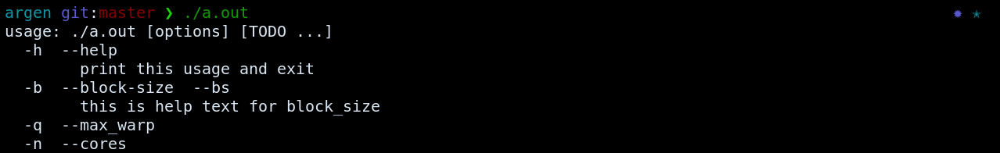

# argen

Generate CLIs with ease. Using argen, you can quickly generate beautiful CLIs like
the one below. 

## Features 
- Create robust command line interfaces by configuring a simple JSON file.
- No programming logic required
- Generated code only uses standard libraries
- Currently supports C

## Installation 

If you do not have Rust installed, first install it:
`https://rustup.rs`

Now, clone the repository. 

`git clone https://github.com/kynelee/argen.git`

## Usage 

argen provides many convenient options for generating a CLI 
such as aliases, positional and non positional parameters, defaults values, and more! 

To build a CLI using argen, you must create a JSON file which describes how your CLI
works. Feel free to modify one of [our examples](examples/simple.json) as a starting point.

After you've created a JSON spec, you can generate your C code using argen.

`run command` 

Check out the corresponding [C code](examples/foo.c) which is generated. It populates C
variables corresponding to the name and type specified in
JSON. It also sets any default variables and contains logic for other
options set in the JSON spec. 

When you run the corresponding executable, you'll notice the usage and help
dialogues which have been created for you. In other words, you've built a fully functioning 
CLI with 0 programming logic!

For a glimpse at the full capabilities of argen, check out this [JSON
spec](examples/robust.json) which provides the configuration and description of all 
modifiable JSON fields. 
