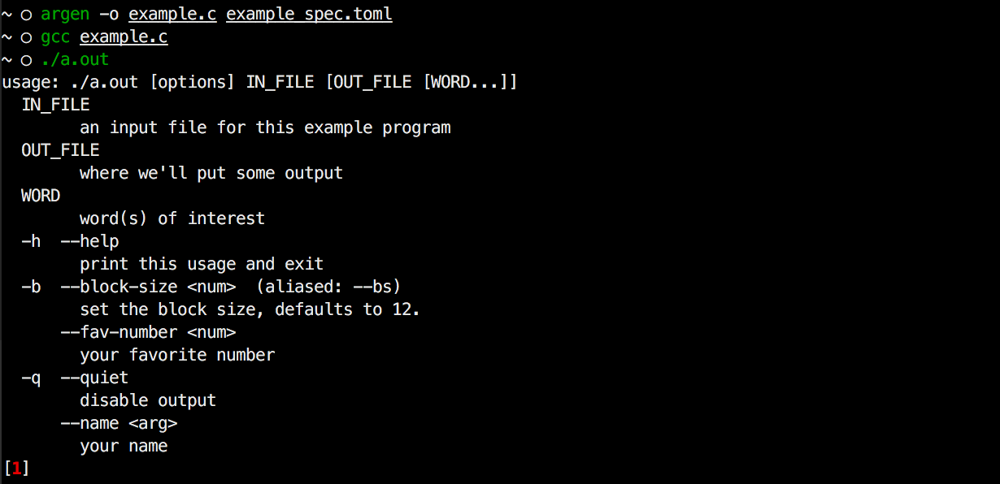

# argen

**`argen`** lets you generate argument parsing logic in C from a simple
config. No more having to write that tedious arg-parsing C code!



```c
// this is what the entry point looks like from the above example

int main(int argc, char **argv) {
	char* out_file;
	char* in_file;
	char* *words;
	size_t words__size;
	int block_size;
	int fave_number;
	int quiet;
	char* username;

	parse_args(argc, argv, &out_file, &in_file, &words, &words__size, &block_size, &fave_number, &quiet, &username);

	/* call your code here */
}
```

## Installation

#### Standalone

We have not yet released precompiled binaries for **`argen`**.

#### Source

```sh
# install rustup.rs
$ curl https://sh.rustup.rs -sSf | sh
# clone the source code
$ git clone https://github.com/kynelee/argen.git
$ cd argen
# build
$ cargo build --release
# copy binary
$ cp target/release/argen /usr/local/bin/argen
```

## Usage

```sh
# write to main.c
$ argen -o main.c spec.toml
# write to stdout
$ argen spec.toml
```

The `spec.toml` file specifies how you want your C code to parse arguments:

```toml
# argen spec
# example usages:
#  $ ./program --block-size 10 --set-flag file1.txt file2.txt word1 word2
#  $ ./program file1.txt

# There are "non_positional" options and "positional" arguments.
#   These take some different fields.
#   This example is exhaustive in showing all  available fields.
#   Positional arguments are *ordered*:
#     All required positional arguments must precede non-required ones.
#     Only the last positional argument can be multiple-valued.


####################
## non-positional ##
####################

[[non_positional]]
c_var = "block_size"               # required, variable name in C
c_type = "int"                     # required, variable type in C (int or char*)
                                   #   for int: calls atoi(arg) to turn arg into int
long = "block-size"                # required, specifies option name
help_name = "num"                  # optional, name of the option's arg shown in --help output
help_descr = "Set the block size"  # optional, description in the --help output
short = "b"                        # optional, shortcut for argument name, 1 ASCII character only
aliases = ["size"]                 # optional, aliases for option
default = "12"                     # optional, default value for variable
                                   #   for int:   assigned as literal
                                   #   for char*: assigned as quoted literal
#required = false                  # optional, makes the option mandatory
                                   #   if set, cannot also provide default
                                   #   (defaults to false)

[[non_positional]]
c_var = "flag_set"
c_type = "int"
long = "set-flag"
help_descr = "Enable something"
flag = true                      # optional, make the option take no argument
                                 #   c_type must be int
                                 #   c_var is 1 if flag is set, 0 otherwise
                                 #   flags cannot also be required


################
## positional ##
################

[[positional]]
c_var  = "input_file"      # required, variable name in C
c_type = "char*"           # required, variable type in C (int or char*)
                           #   for int: calls atoi(arg) to turn arg into int
required = true            # optional, makes the argument mandatory
                           #   if set, cannot also provide default
                           #   (defaults to false)
help_name = "FILE"         # required, NOTE: this is required unlike non-positional
                           #   name of the argument shown in --help output
help_descr = "input file"  # optional, description in the --help output

[[positional]]
c_var = "output_file"
c_type = "char*"
help_name = "OUT"
help_descr = "file for output"
default = "output.txt"          # optional, default value for variable
                                #   for int:   assigned as literal
                                #   for char*: assigned as quoted literal

[[positional]]
multi = true                   # optional, only valid for last positional argument
                               #   we note the different behaviors here
c_var = "words"
c_type = "char*"               # with multi, we can only use char*
                               #   words will actually be a char**,
                               #   and another variable words__size is made
help_name = "WORD"             # with multi, you should be singular here
help_descr = "word(s) to use"
default = "someword"           # with multi, if no values are given and a
                               #   default is specified, words__size will be 1
                               #     and words[0] is the default value
                               #   if no values are given and *no* default is
                               #     specified, words_size will be 0
#required = false              # with multi, makes at least one value mandatory
                               #   (still defaults to false)
```

After generating and compiling the C code, you will have fully functional
argument parsing.
